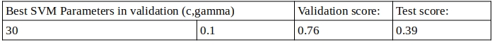
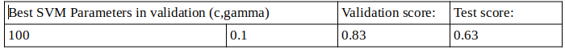

In the name of God.

**Fall Detection using Camera Sensor**
======================================

In this repository we use pretrained deep neural networks to detect
human fall in RGB camera videos. Detecting falling down of elderly
people who live alone is useful to speed up emergency aids. We finetune
C3D and I3D networks (pretrained on action recognition datasets) with
SVMs to detect fall. Results show that this method fails to generalize
data for new environments.

Pretrained models
=================

I3D network processes a batch of 64 RGB of optical-flow frames. We use
model available in \[1\] with only RGB inputs.

C3D network processes a batch of 16 RGB frames. We test different
sampling rates in order to improve results. Model is available in \[2\].

Although C3D networks are very popular in video understanding tasks
(action recognition, video segmentation, etc.), finetuning it doesn't
perform well in fall detection task. This could be due to small datasets
of fall detection or deficiency of C3D model itself.

Datasets
========

Fall detection datasets are few and small. This makes training of any
machine learning model difficult. Here we use these datasets:

\- Fall Detection Dataset\[3\] : It has videos from different
environments in order to test robustness of models. (home\_1: 30 videos,
home\_2: 30, Office:33, coffee\_room\_1: 48)

\- UR fall detection dataset\[4\] : This dataset contains 70 (30 falls +
40 activities of daily living) sequences.

4.  Implementation details
    ======================

    1.  ***Making the datasets:*** 
        ---------------------------

starting and ending frames of falling down, is specified for each video.
Labels are in a text file in each dataset folder(also in labels folder).
Each sample is a clip of video, whose length is 64 frames for i3d, and
32,64, \...(according to downsampling rate) for c3d. If more than 16
frames of video shows falling *and* more than 16 frames of video shows
lying on the floor(the stage after falling), clip label is positive (and
vice versa).

*Preprocessing:* 
-----------------

Preprocessing method for I3D model is available in \[1\]. for C3D model,
some parameters can be changed. Removing background(using MOG2
background subtraction method), sampling rate and clip stride are some
of them.

*Overview of codes: *
---------------------

There are 3 files:

\- trainsvm.py: Set the parameters here. Features are calculated(and
saved). On train datasets(which you specify), cross validation is done
for SVM parameters. Then results are reported for test datasets.

Also a comparison of using different output layers of C3D model is made.

\- extraction.py: Loading models and extracting features with specified
options is done here.

\- visualization.py: Output of different layers of C3D model and output
of I3D model was calculated before. Here dimension reduction and
visualization is done by PCA and TSNE method.

\- sport1m\_model.py: for making the C3D model.\[2\]

*How to test the codes: *
-------------------------

You can simply change these settings in trainsvm.py or visualization.py
code and run with python.

\- options={\'downsample\_rate\':1 , \'background\_sub\':False,
\'stride\':16, \'model\': \'i3d\'} \# use this parameters for i3d

\#options={\'downsample\_rate\':4 , \'background\_sub\':False,
\'stride\':2, \'model\': \'c3d\'} \# use this parameters for c3d

\- label = \'\_i3d\_\_str16v2\' : it is appended to extracted files'
names. (optional)

\- layers = \[2,0,1,3\] : output layers of C3D to test. ( I3D model has
only one output layer)

\- data\_addr = \'data/\' : where to save extracted data

\- ds\_addr= \'/home/amirhossein/Desktop/implement/dataset/fall
detection dataset/\' : address of video folders. It must have this
format:

.

├── Coffee\_room\_01

│   ├── 01.avi

│   ├── 02.avi

│   ├── 03.avi

│   ├── ...

│   └── Coffee\_room\_01.txt

├── Home\_01

│   ├── 01.avi

│   ├── 02.avi

│   ├── ...

│   └── Home\_01.txt

├── Home\_02

│   └── \...

├── Office

│   └── ...

├── ur\_adl

│   └── ...

└── ur\_fall

└── ...

\- datasets =
\[\[\[\'ur\_fall\',\'ur\_adl\',\'Coffee\_room\_01\'\],\[\'Office\',\'Home\_02\',\'Home\_01\'\]\],\\

\[\[\'Office\',\'Home\_02\',\'Home\_01\'\],\[\'ur\_fall\',\'ur\_adl\',\'Coffee\_room\_01\'\]\]\]

with this format: \[\[train dataset list, test dataset list\], ...\]

In this way, you can choose train and test datasets and different
combinations.

*In extraction.py*

\- c3d\_weights = \'models/C3D\_Sport1M\_weights\_keras\_2.2.4.h5\'

\- i3d\_model =
\"/home/amirhossein/Desktop/implement/i3d-kinetics-400\_1\"

Results
=======

During cross validation, best parameters will be determined. Our metric
is (1-falseAlarm)\*sensitivity.

Then this metric is computed for test datasets and will be reported.

*I3D*
-----

train\_dataset: \'ur\_fall\', \'ur\_adl\', \'Coffee\_room\_01\'

test\_dataset:\'Office\', \'Home\_02\', \'Home\_01\'

  ----------------------------------- ------ ------------
  Best SVM Parameters in validation   C=30   Gamma= 0.1
  Validation score:                   0.76   
  Test score:                         0.39   
  ----------------------------------- ------ ------------

tot 1625 alarm 44 f alrm 142 miss 59 else 1380

SVMscore0.876 sens0.427 falarm0.0933 c,g \[30, 0.1\]

train\_dataset:\'Office\', \'Home\_02\', \'Home\_01\'\]

test\_dataset:\'ur\_fall\', \'ur\_adl\', \'Coffee\_room\_01\'

  ----------------------------------- ------- ------------
  Best SVM Parameters in validation   C=100   Gamma= 0.1
  Validation score:                   0.83    
  Test score:                         0.63    
  ----------------------------------- ------- ------------

tot 1235 alarm 99 f alrm 292 miss 18 else 826

SVMscore0.749 sens0.846 falarm0.261 c,g \[100, 0.1\]

Result scores are not high. And by changing train and test datasets,
scores will highly change. So models are not robust to environments (or
at least, UR dataset videos couldn't be generalized.).

Results show that by changing environments, models loose their accuracy.
Looking into visualizations(with TSNE methods) of I3D outputs, also
approves it. In the figure below, each color shows a folder(e.g. Home\_1
environment) and darker points show positive samples (and vice versa).
As you can see, positive samples of each folder are in a distinct part
of space. So if we train a classifier to use these samples to classify
for an environment, it won't be good for another environment.

{width="6.6930555555555555in"
height="4.990972222222222in"}

{width="6.6930555555555555in"
height="4.422916666666667in"}

*C3D*
-----

  ------------------------------------------------ ------ ------------
  Experiment with layer ... of C3D model output.          
  Best SVM Parameters in validation                C=30   Gamma= 0.1
  Validation score:                                0.76   
  Test score:                                      0.39   
  ------------------------------------------------ ------ ------------

  ------------------------------------------------ ------ ------------
  Experiment with layer ... of C3D model output.          
  Best SVM Parameters in validation                C=30   Gamma= 0.1
  Validation score:                                0.76   
  Test score:                                      0.39   
  ------------------------------------------------ ------ ------------

  ------------------------------------------------ ------ ------------
  Experiment with layer ... of C3D model output.          
  Best SVM Parameters in validation                C=30   Gamma= 0.1
  Validation score:                                0.76   
  Test score:                                      0.39   
  ------------------------------------------------ ------ ------------

  ------------------------------------------------ ------ ------------
  Experiment with layer ... of C3D model output.          
  Best SVM Parameters in validation                C=30   Gamma= 0.1
  Validation score:                                0.76   
  Test score:                                      0.39   
  ------------------------------------------------ ------ ------------

6.  Discussion
    ==========

    References
    ==========

\[1\]
[[https://www.tensorflow.org/hub/tutorials/action\_recognition\_with\_tf\_hub]{.underline}](https://www.tensorflow.org/hub/tutorials/action_recognition_with_tf_hub)

\[2\]
[[https://github.com/aslucki/C3D\_Sport1M\_keras]{.underline}](https://github.com/aslucki/C3D_Sport1M_keras)

\[3\]
[[http://le2i.cnrs.fr/Fall-detection-Dataset?lang=fr]{.underline}](http://le2i.cnrs.fr/Fall-detection-Dataset?lang=fr)

\[4\]
[[http://fenix.univ.rzeszow.pl/\~mkepski/ds/uf.html]{.underline}](http://fenix.univ.rzeszow.pl/~mkepski/ds/uf.html)

citation
========

If you use this code base in your work, please cite

\@software{FallDetectionUsingCaemraSensor,

author = {Amirhossein Arefipour and Hoda Mohammadzadeh},

title = {Fall Detection using Camera Sensor},

url =
{[[https://github.com/amarefi/fall\_detection]{.underline}](https://github.com/amarefi/fall_detection)},

version = {1.0}

year = {2020},

}

contact
=======

For questions about our paper or code, please contact [[A.
Arefipour]{.underline}](mailto:arefipour.amirhossein@ee.sharif.ir)
